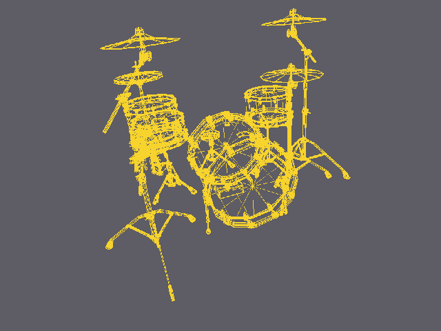
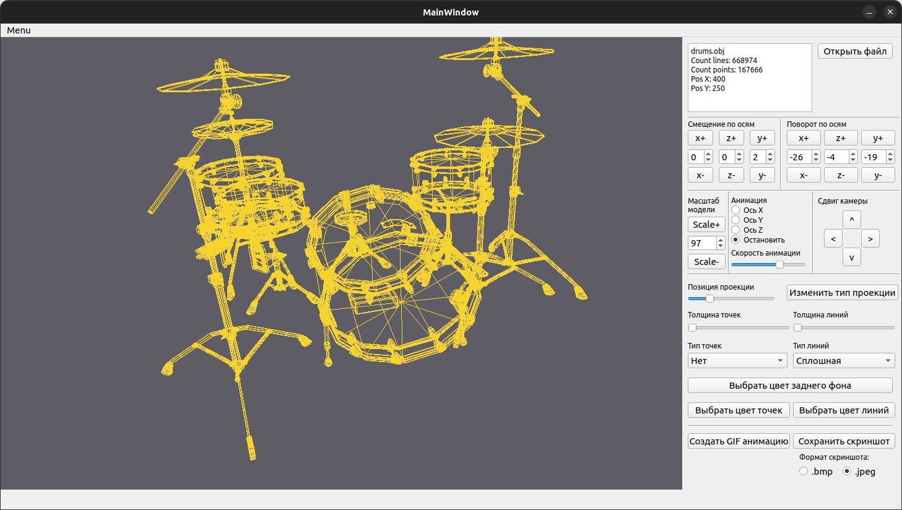
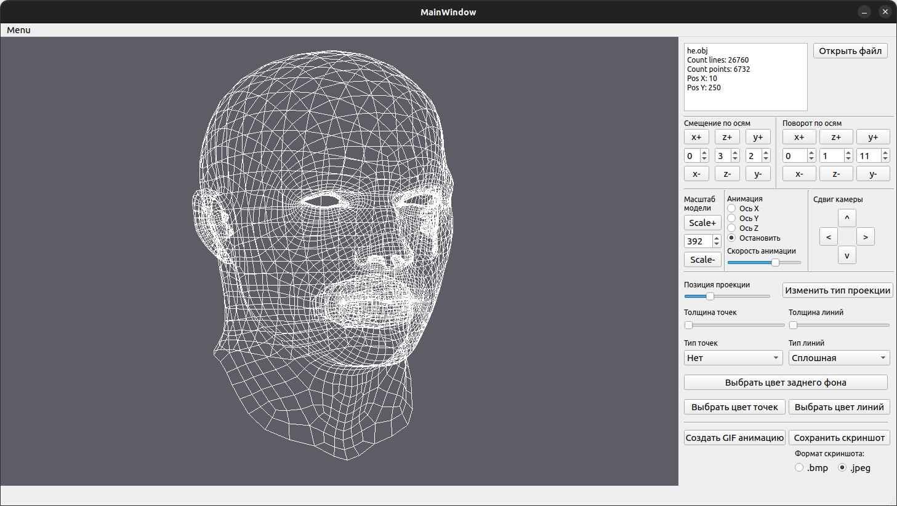
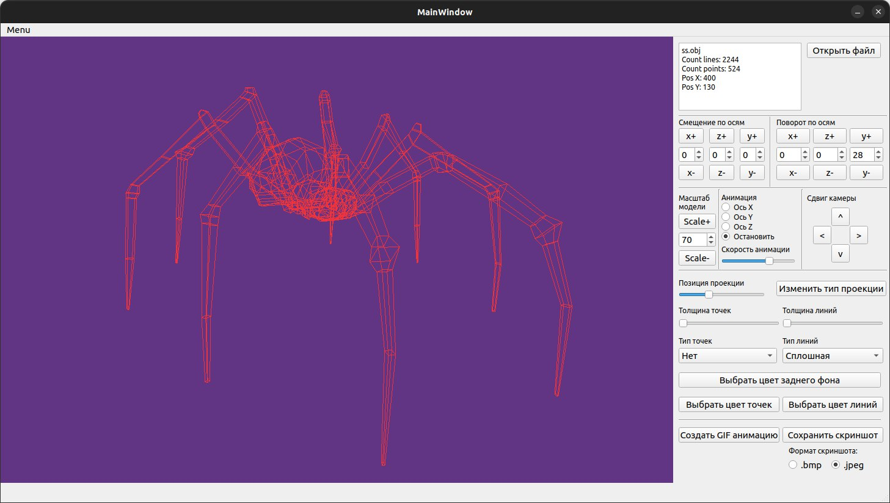

# 3DViewer v1.0

  

## Contents

   [Part 1](#part-1-3dviewer) - 3DViewer
   [Part 2](#part-2-дополнительно-настройки) - Настройки 
   [Part 3](#part-3-дополнительно-запись) - Запись
   [Part 4](#part-4-скриншоты) - Скриншоты
    
## Part 1. 3DViewer

- Программа разработана на языке Си стандарта C11 с использованием компилятора gcc и модулей QT
- Сборка программы настроена с помощью Makefile со стандартным набором целей для GNU-программ: all, install, uninstall, clean, dvi, dist, tests, gcov_report.
- Программа разработана в соответствии с принципами структурного программирования
- Обеспечено покрытие unit-тестами модулей, связанных с загрузкой моделей и аффинными преобразованиями
- Программа предоставляет возможности:
    - Загружать каркасную модель из файла формата obj (поддержка только списка вершин и рёбер).
    - Перемещать модель на заданное расстояние относительно осей X, Y, Z.
    - Поворачивать модель на заданный угол относительно своих осей X, Y, Z
    - Масштабировать модель на заданное значение.
- В программе реализован графический пользовательский интерфейс, на базе Qt с API для C11
- Графический пользовательский интерфейс содержит:
    - Кнопку для выбора файла с моделью и поле для вывода его названия.
    - Зону визуализации каркасной модели.
    - Кнопку/кнопки и поля ввода для перемещения модели. 
    - Кнопку/кнопки и поля ввода для поворота модели. 
    - Кнопку/кнопки и поля ввода для масштабирования модели.  
    - Информацию о загруженной модели - название файла, кол-во вершин и ребер.
- Программа корректно обрабатывает и позволяет пользователю просматривать модели с деталями до 100, 1000, 10 000, 100 000, 1 000 000 вершин без зависания

## Part 2. Дополнительно. Настройки

 - Программа позволяет настраивать тип проекции (параллельная и центральная)
 - Программа позволяет настраивать тип (сплошная, пунктирная), цвет и толщину ребер, способ отображения (отсутствует, круг, квадрат), цвет и размер вершин
 - Программа позволяет выбирать цвет фона
 - Настройки позволяет сохраняться между перезапусками программы

 ## Part 3. Дополнительно. Запись

 - Программа позволяет сохранять полученные ("отрендеренные") изображения в файл в форматах bmp и jpeg
 - Программа позволяет по специальной кнопке записывать небольшие "скринкасты" - текущие пользовательские аффинные преобразования загруженного объекта в gif-анимацию (640x480, 10fps, 5s)
 - Программа позволяет заставить модель вращаться вокруг выбранной оси, с заданной скоростью.
 
 
 ## Part 4. Скриншоты
 

 

